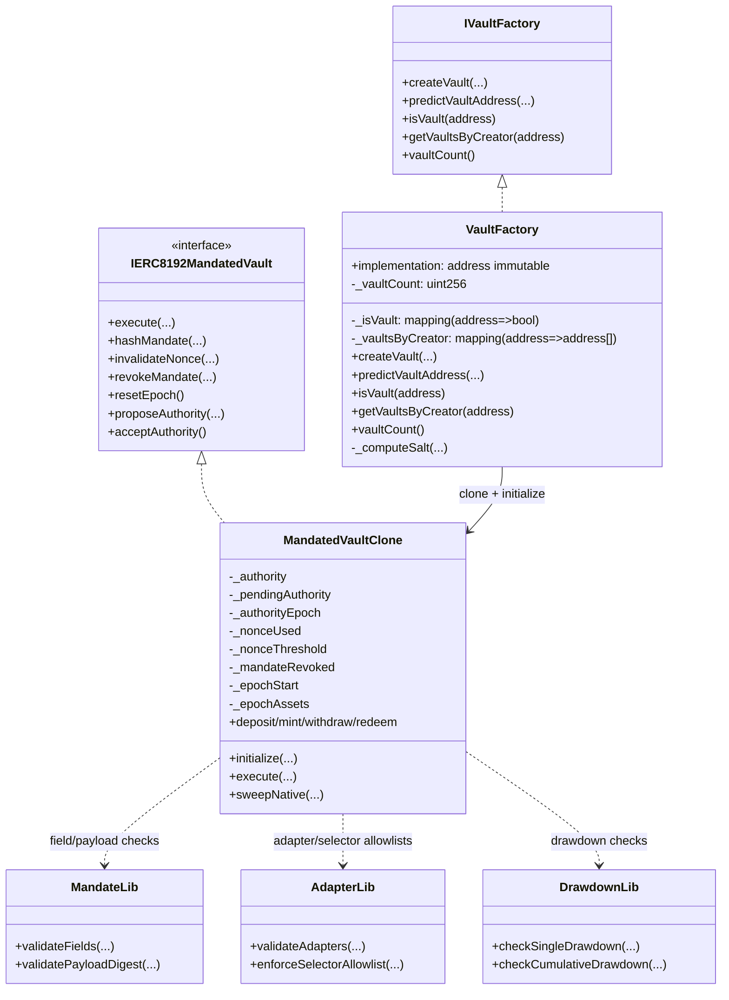

# Mandated Vault Factory Architecture

This document describes the architecture of the `mandated-vault-factory` codebase for open-source contributors.

## 1. System Scope

The project provides deterministic deployment (`CREATE2`) of ERC-4626 mandated-execution vaults.

Key runtime roles:
- **Creator**: deploys vault clones through `VaultFactory`.
- **Authority**: signs mandates and controls revocation/epoch management.
- **Executor**: submits signed mandates and executes action bundles.
- **Depositor**: uses ERC-4626 deposit/mint/withdraw/redeem.
- **Adapter**: external contract called by vault during mandate execution.

## 2. High-Level Component Diagram

```mermaid
flowchart LR
    Creator[Creator] -->|createVault| Factory[VaultFactory]
    Creator -->|predictVaultAddress| Factory
    Factory -->|cloneDeterministic + initialize| Vault[MandatedVaultClone]

    Authority[Authority] -->|EIP-712 signature\n or ERC-1271 validation target| Vault
    Executor[Executor] -->|execute(mandate, actions, proofs, extensions)| Vault
    Depositor[Depositor] -->|ERC-4626 methods| Vault

    Vault -->|adapter.call(data)| Adapter[Whitelisted Adapter Contracts]
    Vault -->|asset transfers/accounting| Asset[(ERC-20 Asset)]

    Vault -. validation .-> MandateLib[MandateLib]
    Vault -. validation .-> AdapterLib[AdapterLib]
    Vault -. circuit breaker .-> DrawdownLib[DrawdownLib]
```

## 3. Contract Topology



## 4. Security and Control Layers

```mermaid
flowchart TD
    A[Input Mandate + Actions] --> B[MandateLib.validateFields]
    B --> C[Extensions hash + decode]
    C --> D[Mandate revocation check]
    D --> E[Signature verification\nEOA(ECDSA) or Contract(ERC-1271)]
    E --> F[Nonce threshold + nonce used checks]
    F --> G[Payload digest binding]
    G --> H[Adapter allowlist proof check]
    H --> I[Optional selector allowlist proof check]
    I --> J[Execute adapter calls]
    J --> K[DrawdownLib checks\nsingle + cumulative]
    K --> L[Emit MandateExecuted]
```

## 5. Storage and State Ownership

- `VaultFactory` stores deployment registry only:
  - `implementation`
  - `_vaultCount`
  - `_isVault`
  - `_vaultsByCreator`
- `MandatedVaultClone` stores all execution authority/risk state:
  - authority transfer state (`_authority`, `_pendingAuthority`, `_authorityEpoch`)
  - replay/revocation state (`_nonceUsed`, `_nonceThreshold`, `_mandateRevoked`)
  - drawdown epoch state (`_epochStart`, `_epochAssets`)

## 6. Source-of-Truth Files

- `src/VaultFactory.sol`
- `src/interfaces/IVaultFactory.sol`
- `src/MandatedVaultClone.sol`
- `src/interfaces/IERC8192MandatedVault.sol`
- `src/libs/MandateLib.sol`
- `src/libs/AdapterLib.sol`
- `src/libs/DrawdownLib.sol`
- `test/VaultFactory.t.sol`
