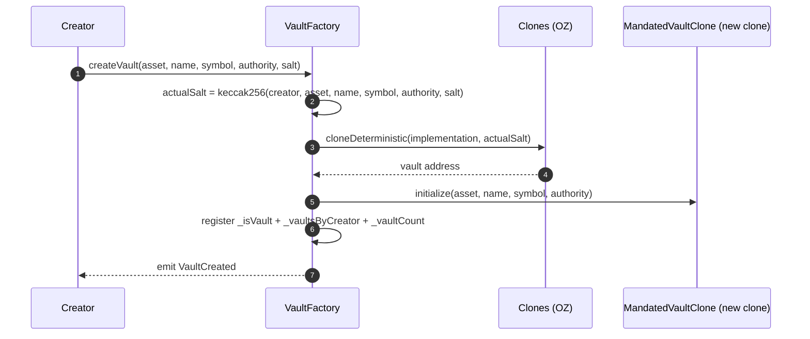
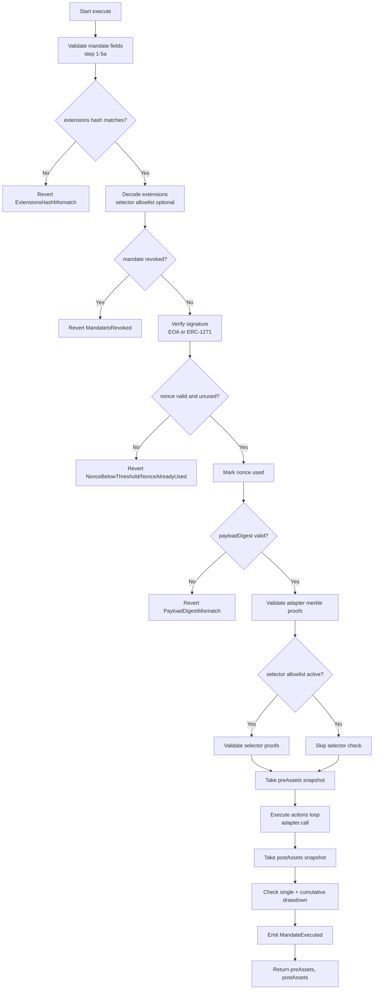
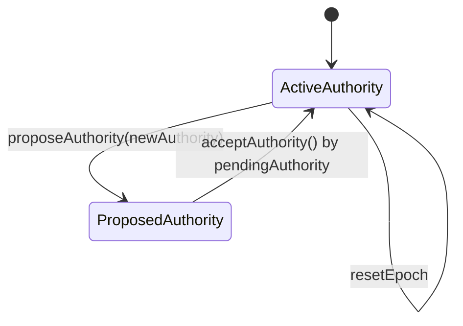
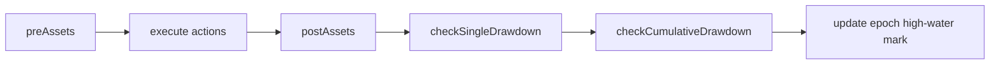

# Mandated Vault Factory Flows

This document captures key runtime flows and contributor-facing execution paths.

## 1. Deterministic Vault Creation Flow (`createVault`)



## 2. Address Prediction Flow (`predictVaultAddress`)

```mermaid
flowchart TD
    A[Input params] --> B{Which overload?}
    B -->|without creator| C[creator = msg.sender]
    B -->|with creator| D[use explicit creator]
    C --> E[actualSalt = keccak256(creator, asset, name, symbol, authority, salt)]
    D --> E
    E --> F[Clones.predictDeterministicAddress]
    F --> G[predicted vault address]
```

## 3. Mandate Execution Main Flow (`execute`)



## 4. Authority Lifecycle Flow



## 5. Drawdown Protection Flow



## 6. Failure Surface Map

- **Authorization/identity**: `NotAuthority`, `UnauthorizedExecutor`, `InvalidSignature`.
- **Replay/revocation**: `NonceAlreadyUsed`, `NonceBelowThreshold`, `MandateIsRevoked`.
- **Payload/extension integrity**: `PayloadDigestMismatch`, `ExtensionsHashMismatch`, `InvalidExtensionsEncoding`, `ExtensionsNotCanonical`.
- **Adapter controls**: `AdapterNotAllowed`, `SelectorNotAllowed`, `InvalidActionData`, proof depth errors.
- **Risk controls**: `DrawdownExceeded`, `CumulativeDrawdownExceeded`.
